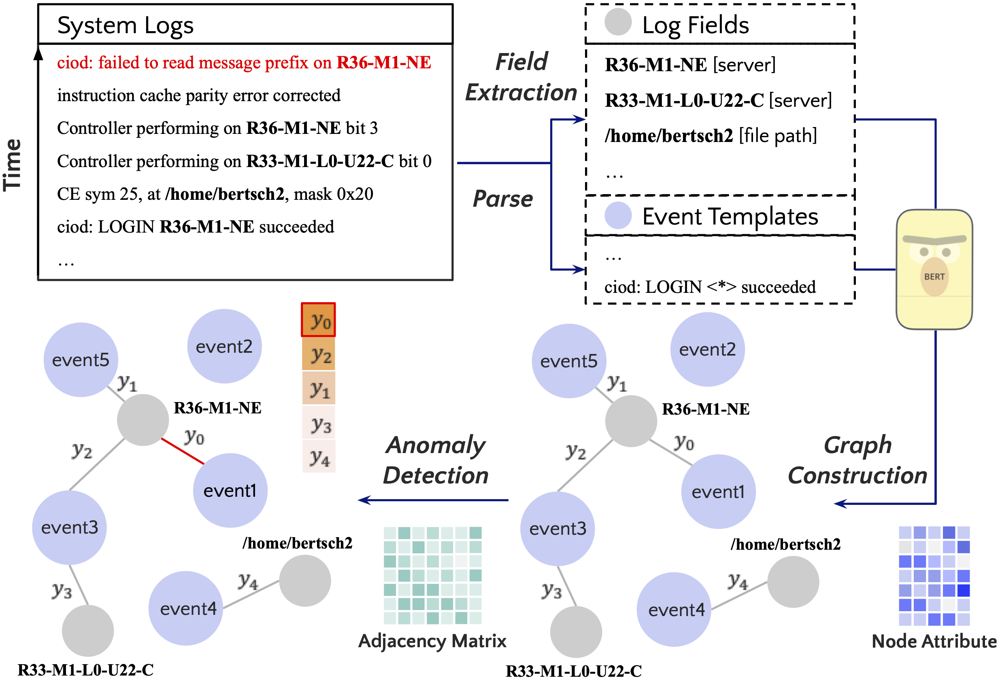
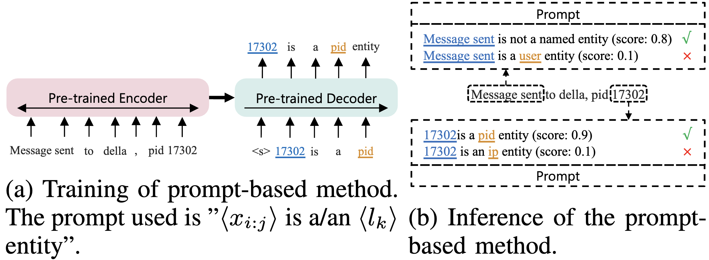
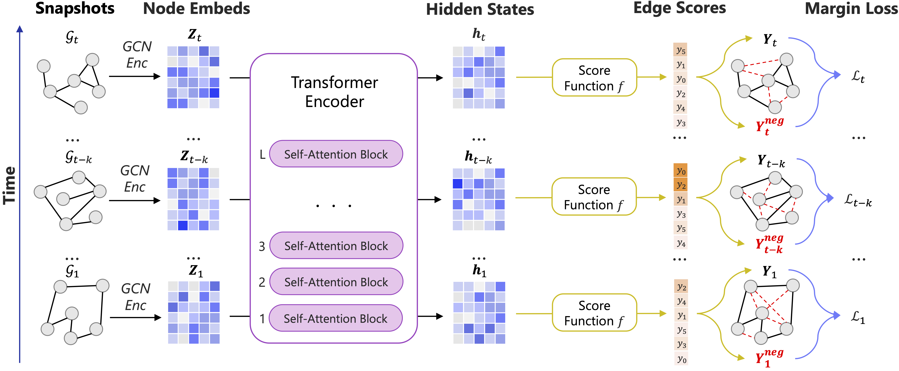

# GraphLogAD
Codebase for the ICKG 2023 paper: "GLAD: Content-aware Dynamic Graphs For Log Anomaly Detection" ([PDF](https://arxiv.org/pdf/2309.05953.pdf)).

- Framework overview
<p align="center">
  
</p>

- Few-shot log field extraction
<p align="center">
  
</p>

- Graph-based edge anomaly detection
<p align="center">
  
</p>


### Quick Start
- Python 3.10.8
- [PyTorch 1.13.1](https://pytorch.org/get-started/locally/)
- Install [PyTorch Geometric](https://pytorch-geometric.readthedocs.io/en/latest/install/installation.html)
```
conda install pyg -c pyg
```
- Install dependencies
```
pip install -r requirements.txt
```

### Extract named entities from log messages
```
python NER.py \
    --gen_data ${DATA} \
    --data_name ${DATA_NAME} \
    --output_dir ${OUT_DIR} \
    --strategy ${STRATEGY} \
    --n_shots ${NUM_SHOTS} \
    --n_grams ${N_GRAMS} \
    --neg_rate ${NEG_RATE} \
    --labeling_technique ${LABEL_METHOD} \
    --model_name_or_path ${PRETRAINED_MODEL} \
    --num_train_epochs ${EPOCHS} \
    --do_train \
    --do_eval \
    --train_batch_size ${TRAIN_BATCH} \
    --eval_batch_size ${EVAL_BATCH} \
    --gradient_accumulation_steps ${GRAD_CUM_STEPS} \
    --ckpt_dir ${CKPT_DIR} \
    --seed ${SEED} \
    --overwrite_cache
```

### Generate datasets
```
python graph_generation.py \
    --root ${ROOT} \
    --log_file ${DATA} \
    --inference_type ${INFERENCE} \
    --strategy ${STRATEGY} \
    --label_type node \
    --pretrained_model_name_or_path ${MODEL_PATH} \
    --interval ${INTERVAL} \
    --event_template 
```

### Train graph anomaly detection model
```
python main.py \
    --root ${ROOT} \
    --checkpoint_dir ${CKPT} \
    --train_batch_size ${TRAIN_BATCH_SIZE} \
    --eval_batch_size ${EVAL_BATCH_SIZE} \
    --model_type dynamic \
    --pretrained_model_path ${MODEL_PATH} \
    --lambda_seq ${LAMBDA} \
    --classification ${CLASSIFICATION} \
    --max_length ${MAX_LENGTH} \
    --lr ${LR} \
    --layers ${LAYERS} \
    --weight_decay ${WEIGHT_DECAY} \
    --do_train \
    --do_eval \
    --multi_granularity \
    --global_weight ${GLOBAL_WEIGHT} \
    --from_scratch
```


### Citation
If you find this repository useful in your research, please cite our paper:
```bibtex
@inproceedings{li2023glad,
  title={Glad: Content-aware dynamic graphs for log anomaly detection},
  author={Li, Yufei and Liu, Yanchi and Wang, Haoyu and Chen, Zhengzhang and Cheng, Wei and Chen, Yuncong and Yu, Wenchao and Chen, Haifeng and Liu, Cong},
  booktitle={2023 IEEE International Conference on Knowledge Graph (ICKG)},
  pages={9--18},
  year={2023},
  organization={IEEE}
}
```

